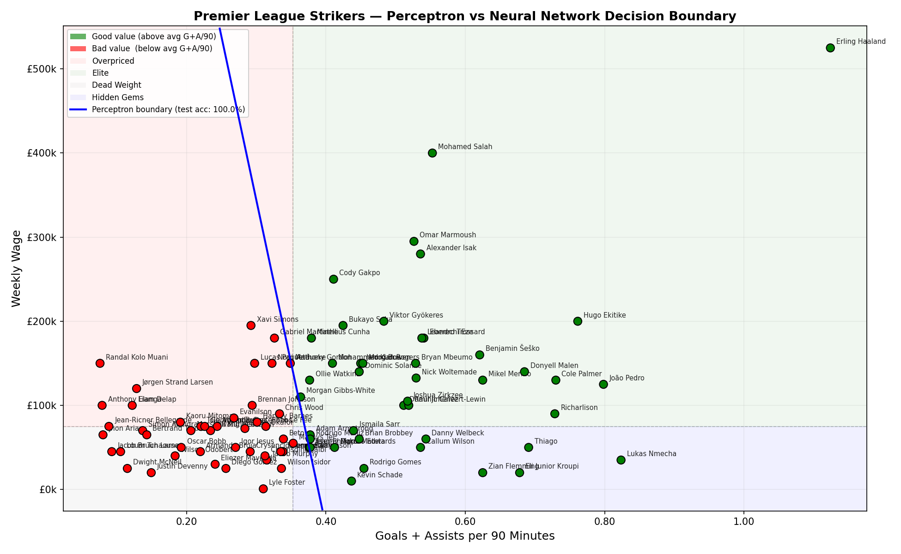

# Premier League Striker Value Analyser

A web app that compares Premier League strikers by **Goals + Assists per 90 minutes** 
vs **weekly wage**, using a perceptron trained from scratch with NumPy to learn 
the value boundary.

## What it does
- Scrapes player stats and wage data from FBref
- Trains a perceptron (built from scratch, no ML libraries) to classify 
  strikers as good or bad value using their Goals + Assists per 90 minutes vs their wages.
- Lets you search and compare any two Premier League strikers
- Generates a plot showing both players highlighted against the full dataset

## Setup

### 1. Clone the repo
git clone https://github.com/YOURUSERNAME/pl-striker-analyser.git
cd pl-striker-analyser

### 2. Install dependencies
pip install -r requirements.txt

### 3. Download the data
You need two HTML files from FBref saved in the project root:
- Go to https://fbref.com/en/comps/9/stats/Premier-League-Stats
  and save the page as pl_stats.html
- Go to https://fbref.com/en/comps/9/wages/Premier-League-Wages
  and save the page as pl_wages.html

### 4. Run the app
python app.py

### 5. Open in browser
http://127.0.0.1:5000

## Tech Stack
- Python, NumPy, Pandas, Matplotlib
- Flask
- Perceptron trained from scratch (no sklearn)

## Concepts Used
- Perceptron training algorithm (Lab 1)
